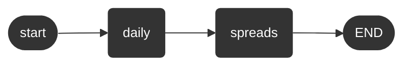

# Hello

Parent: [The Artificial Intelligence Unit](https://github.com/theartificialintelligenceunit)

 
 

The execution order of daily runs

 

A GPU (graphics processing unit) based alternative

 
 

 
 

 
 

 
 
