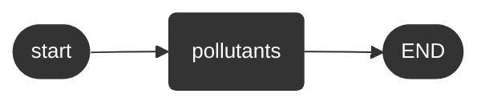
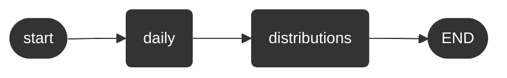

# Hello

Parent: [The Artificial Intelligence Unit](https://github.com/theartificialintelligenceunit)

 
 

This is **(a)** an illustrative investigation of Amazon Web Services for colleagues via particulates data, and **(b)** an exploration of the particulate data for a forecasting project.

 

<b>Executions Order</b>

 

<table style="width: 85%; border: 0; border-spacing: 5px; margin-left: 15px">
<colgroup>
    <col span="1" style="width: 69.5%;">
</colgroup>
<tr><td>
    
Acquiring, or re-acquiring, baseline/historical data.

</td></tr>
</table>

 

The execution order of daily runs.

 

The execution order of daily runs; a GPU (graphics processing unit) based alternative.

 
 

 
 

 
 

 
 
