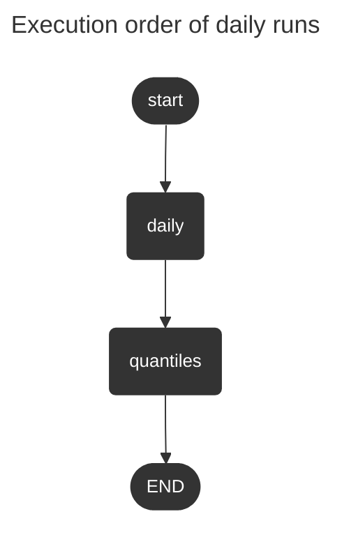

# Hello

Parent: [The Artificial Intelligence Unit](https://github.com/theartificialintelligenceunit)

 
 

```mermaid
---
title: Execution order of daily runs
---
flowchart TD    
    id0([start]) --> id1(<span title="get yesterday's nitrogen readings">daily</span>)
    id1 --> id2(<span title="recalculate the daily quantiles across time">quantiles</span>)
    id2 --> id3([END])
    
    classDef default fill:#333333,stroke:#333333,stroke-width:0px,color:#ffffff,font-size:10pt;
```

 
 
